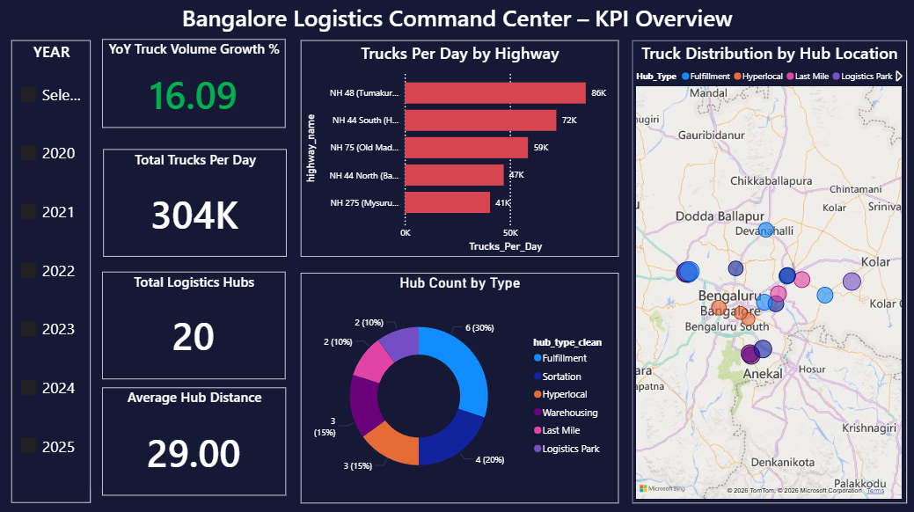
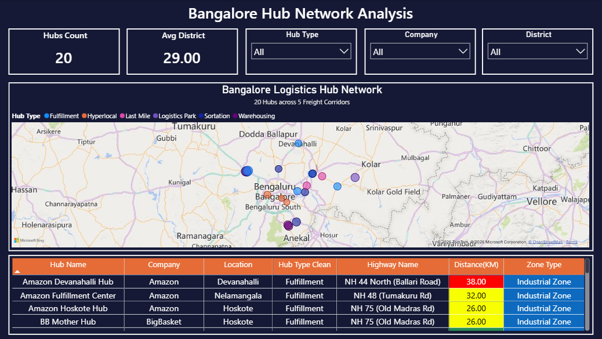
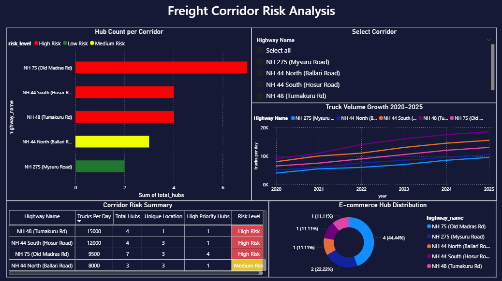
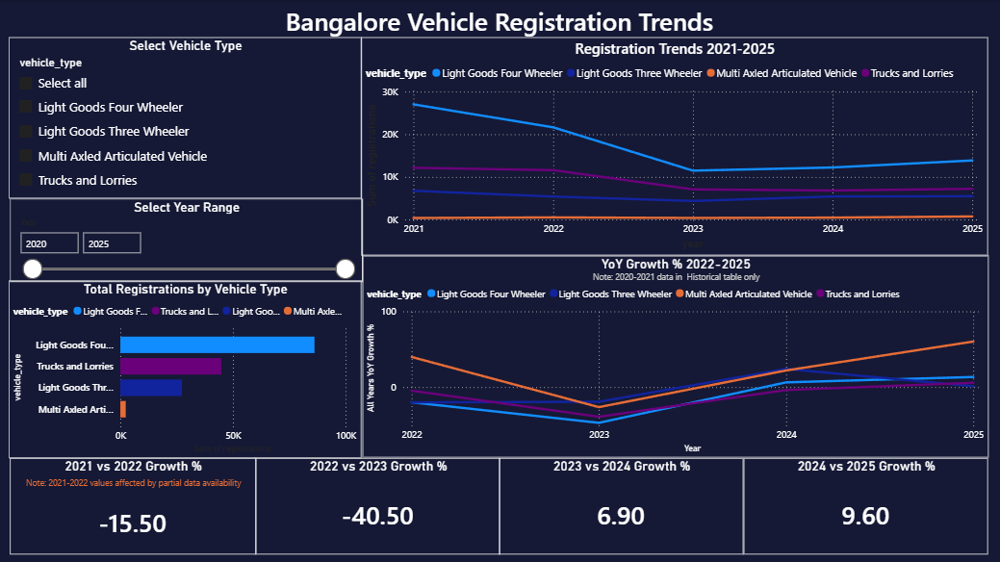

# Bangalore Logistics & Vehicle Growth Analytics

## Project Overview
This project provides a comprehensive analysis of the logistics landscape in Bangalore, India. It combines industrial zone data, freight corridor volumes, and logistics hub locations with historical and projected vehicle registration trends (2020–2025). The goal is to identify high‑risk congestion corridors and optimize the placement of future fulfillment centers.

## Key Features
- **Geospatial Mapping:** Precise plotting of 20+ major logistics hubs (Amazon, Flipkart, Delhivery, etc.) across 5 key freight corridors.
- **Normalization Engine:** Converts cumulative vehicle stock data into monthly registration flows for accurate trend analysis.
- **Risk Profiling:** A custom SQL‑based risk model that calculates corridor status based on truck volume and hub density.
- **Star Schema Design:** Optimized data model for high‑performance Power BI reporting.

## Data Structure
- `Data/bangalore_logistics_MASTER.xlsx`: Unified fact table for monthly vehicle growth (2020–2025).
- `Data/Bangalore_Vehicle_Registration.xlsx`: Raw registration data by vehicle type and year.
- `Data/City_Trends.xlsx`: Historical city-level vehicle registration trends.
- `Data/Current_State_2025.xlsx`: Snapshot of vehicle stock as of 2025.
- `Data/Historical_Zonal.xlsx`: Zonal distribution of registrations across Bangalore regions.

## Setup Instructions
1. **SQL Database:**  
   - Run the provided schema scripts to create the tables and views.  
   - Import the cleaned Excel files in the specified order to maintain referential integrity.  

2. **Power BI:**  
   - Connect to the SQL database or the Excel files.  
   - Establish 1‑to‑Many relationships from Corridors/Zones to the Hubs table.  
   - Use the provided `.pbix` file for ready‑made visuals.

## Dashboard Preview
  
  
  
  

## Results & Insights
- 40% of hubs concentrated in Nelamangala and Hoskote.  
- NH 48 carries 15,000 trucks/day with no alternate route.  
- Multi‑axled vehicles grew 60% in 2025 vs 2024.  
- NH 75 identified as the most critical e‑commerce corridor. 

## Author
**Pavan**  
Data Analyst | Bengaluru, India  
[GitHub Profile](https://github.com/Pa7an-dot)
